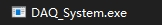
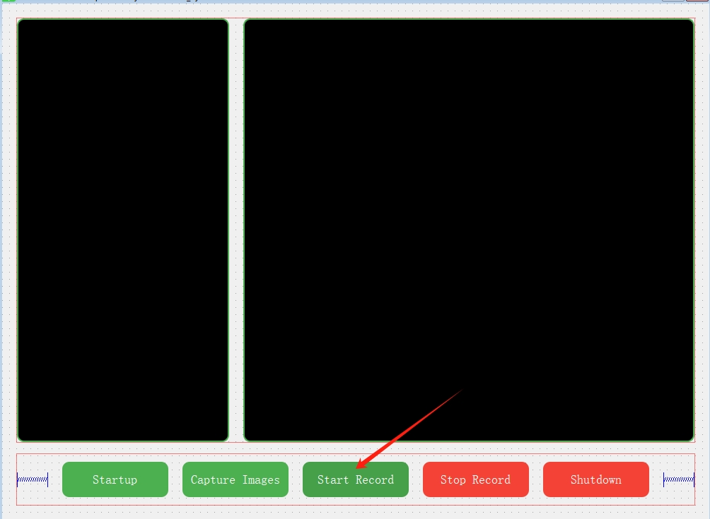
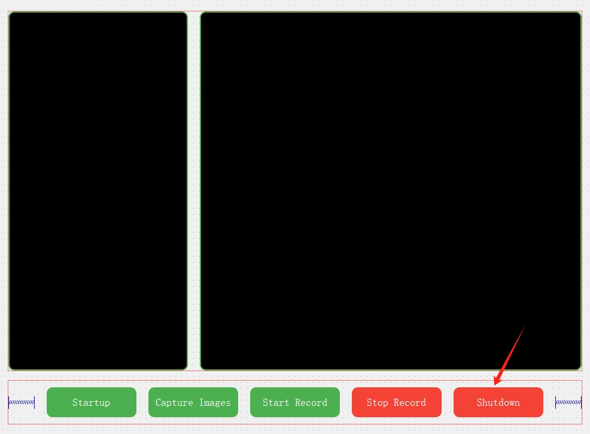
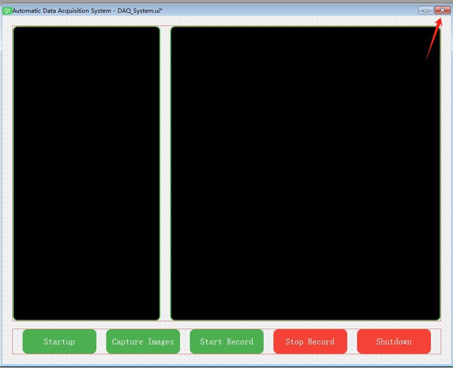

# 使用说明  
## 开始  
- 点击exe文件启动程序  
  
## 运行  
- 点击开始录制，开启摄像头，开始自动数据采集  
  
- 点击关闭，结束录制，关闭摄像头  
  
## 结束  
- 结束程序  
  

# 核心逻辑  
1. 用YOLOv8进行目标检测  
2. 用opencv提供的tracker进行单目标跟踪  
3. 自定义id管理逻辑  
	1. 对比两帧之间bbox中心x坐标，如果相差超过600像素，认为产生了新的个体，id自增  
	2. 当前bbox的中心的x坐标超过屏幕一半且当前个体中心位置尚未保存时，认为当前个体应当进行中心位置保存，然后将saved位置为true，代表当前个体中心位置图像已经采集。